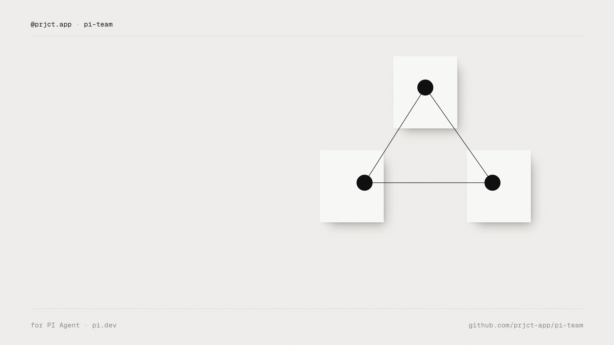

# pi-team

[](https://pi.dev)

Coordinate independent PI Agent sessions with local team messaging, queued tasks,
and shared results.

You open the terminals; `pi-team` lets those sessions send each other work, wake a
free teammate, and return a result the requester can verify. Everything stays on
this machine, in local files.

[](https://github.com/prjct-app/pi-team/raw/refs/heads/main/media/pi-team-demo/pi-team-demo.mp4)

## Install

Requires Pi installed separately and Node.js **22.19 or later**. Tested against
Pi **0.85.1**; newer versions are not yet verified. Independent community package.

```sh
pi install npm:@prjct.app/pi-team
```

Add `-l` for project-only installation, and restart Pi afterwards. Manage it with
the usual `pi list` / `pi update` / `pi remove` and `pi config`. Do not install the
same extension from both GitHub and npm: Pi treats those as different packages.

## Quickstart

Open two interactive Pi terminals. In the first:

```text
/team create demo
/team join demo coordinator
```

In the second:

```text
/team join demo reviewer
```

Back in the first:

```text
/team note reviewer Please review the current README.
/team send reviewer Add a limits table to the README.
```

The note appears in the reviewer's transcript without starting any model work.
The request wakes the reviewer once it is idle, and its result comes back to the
coordinator. Installing alone never joins a team.

Supported on Linux and macOS with local disk storage. Network filesystems,
cross-machine messaging, and native Windows are not supported.

## Concepts

A **team** is a named local mailbox. A session joins under an **alias**: an
address, not a privileged role or an automatic persona, and shared rather than
private — anyone using this OS account can rejoin an offline alias and see its
history. Each session keeps its own model, cwd, instructions, permissions, and
conversation. Two agents editing the same files can still overwrite each other:
this package does not manage file ownership.

| Kind | Meaning |
| --- | --- |
| `request` | Work for a teammate. Starts a model turn when the recipient is idle, and always produces one correlated result back to the emitter. |
| `note` | Display-only FYI. Appears in the transcript; never starts a model turn. |
| `result` | The automatic reply to a request: outcome, final text, and observed files. Delivered to the emitter for verification. |

While joined, a minimal widget above the editor shows `team · alias · state`,
where state is `connected`, `working`, `paused`, or `select a model`, plus a
pending count when work is queued for you.

Membership is restored automatically when the same Pi session is resumed or
reloaded. `/new` and `/fork` start unaffiliated sessions on purpose.

## Commands

| Command | Meaning |
| --- | --- |
| `/team create shop` | Create explicitly; does not join automatically |
| `/team join shop backend` | Register this session and enable automatic reception |
| `/team list` | List teams; refresh team-name completion |
| `/team members` | Show aliases, cwd, and idle/busy/paused/offline status |
| `/team status` | Show every unresolved requester → assignee relationship |
| `/team wake [message]` | Queue an actionable check-in for every other teammate |
| `/team send backend Implement login` | Queue a request that can start work |
| `/team note frontend API contract changed` | Display an FYI; never starts a model turn |
| `/team inbox` | Show the most recent 20 records and their states |
| `/team pause` | Pause new work, without cancelling current work |
| `/team resume` | Resume reception and reset the automatic turn budget |
| `/team leave` | Leave; if processing a request, report its result first |

Names and aliases are 1–48 lowercase letters, digits, or hyphens, starting with a
letter. Unknown teams are rejected, never implicitly created; duplicate live
aliases are rejected. Sending to an offline **known** alias queues until someone
rejoins it. Tab completion covers subcommands, discovered teams, and teammates.

## Agent tools

- `team_members` — discover teammates and their status.
- `team_send` — send `{ to, kind: "request" | "note", subject, body }`.
- `team_status` — outstanding work: what you emitted and is unresolved, what is
  queued for you, results awaiting your review, and third-party team activity.

Tools cannot create teams, join, resume reception, change permissions, or launch
terminals; they require membership you established. A request returns **queued**,
never "task completed".

## How delivery works

A request or result starts a turn only when the recipient is idle, has a selected
model, no pending user message or open prompt, and an empty editor. No running
tool is interrupted.

For each processed request the extension sends **one** result after the agent
settles: the last assistant text capped at 3,000 characters (no thinking), up to
50 absolute paths observed in successful `edit`/`write` calls, and an outcome of
completed, failed, or interrupted.

That file list is **not** a Git diff. Files changed through bash, custom tools, or
other processes are not enumerated, and the extension never infers test success
from a shell command or a model claim. **A completed run is not proof of success**:
review the reported outcome and the recipient worktree.

Once a task result is persisted, the session can accept the next queued request.
While a request you emitted stays unresolved past five minutes, a review turn
asks your agent to chase the teammate or tell you what is blocked. See
[Architecture](docs/architecture.md) for implementation details.

## Safety

- **This is not a sandbox or an authorization system.** Agents and processes under
  the same OS user already have filesystem access. Prompt-level rules are not a
  hard guarantee against a model that ignores them. Do not place untrusted agents
  in a team or rely on team boundaries to protect secrets from that OS user.
- Peer messages are identified as untrusted data and **are not user consent**.
  Agents are instructed not to relay denied work, change configuration, or evade
  plan mode. Peer text is never executed as a slash command or expanded as a file
  mention.
- Messages stay in local files, but when processed their text goes to the
  recipient's configured **model provider** like any prompt, and results go to the
  requester. Do not send credentials or unrelated secrets.
- User takeover during a peer task pauses reception and reports an interrupted
  result instead of forwarding your unrelated work.

## Limits

| Limit | Value |
| --- | --- |
| Automatic peer turns before reception pauses | 5, then `/team resume` |
| Messages in one automatically linked conversation | 8 non-result |
| Unsettled deliveries per member | 50 slots, one reserved per outstanding request |
| Records per team | 500, including reserved result capacity |
| Members per team | 100 |
| Outgoing body / serialized message | 16 KB / 20 KB |
| Automatic result | 32 KB, file list shortened with a notice |
| Presence lease | 30 s, renewed every 2 s |
| Review threshold / cadence | 5 min unresolved, checked every 1 min |
| Duplicate suppression | identical message within 1 min is refused |

No daily token or monetary budget is enforced. History is never silently deleted:
create a fresh team when one is full. Review cadence and the turn budget are fixed
defaults, not user-configurable yet.

## Troubleshooting

| Symptom | Cause and action |
| --- | --- |
| A request stays queued | Run `/team status`. The recipient may be busy, paused, offline, missing a model, or typing. After five minutes, review turns chase it or surface the blockage. |
| `Team auto-turn limit reached` | Five automatic turns ran without user input. Review the transcript, then `/team resume`. |
| `Membership expired or replaced` | Another live session took your alias. Rejoin, choosing a new alias if the old one is in use. |
| `Recipient inbox full` / `Sender inbox full` | Fifty unsettled deliveries per member, one slot reserved per outstanding request. Let the teammate drain; notes need no reservation. |
| `Team history full (500 records)` | At capacity; history is never deleted. Create a fresh team and rejoin. |
| Repeated storage warnings | Conflicts retry automatically and never pause reception. If one persists, check that the teams directory is on a local disk and report it. |
| A teammate went offline mid-task | Its claimed work is interrupted and the emitter receives that result; it is not replayed. Review the worktree, then resend explicitly. |

## Development

```sh
npm ci --ignore-scripts
npm run check
npm test
npm run check:package
```

Pi loads the TypeScript entry point directly; there is no build step. Use `pi -e .`
to try a checkout. Tests use isolated temporary state and never call model APIs.

`npm run check` also enforces that `src/` contains no `let`: session state is a
single immutable record updated functionally, and reads go through its accessor at
the point of use rather than being captured across an `await`.

## More

- [Architecture](docs/architecture.md) — storage, concurrency, recovery, context budget
- [Package structure](docs/package.md) · [Releases](docs/releases.md) · [Contributing](CONTRIBUTING.md) · [Changelog](CHANGELOG.md)

[MIT](LICENSE).
