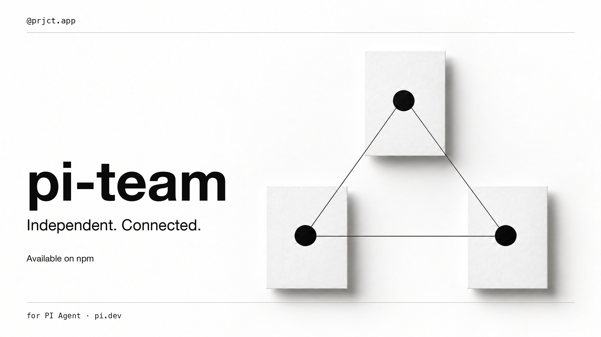

# pi-team promotional film

[Watch or download the video](https://github.com/prjct-app/pi-team/raw/refs/heads/main/media/introduction/pi-team-introduction.mp4)

A 33-second brand film for pi-team, an extension for PI Agent. Monochrome paper artwork, oversized typography, subtle motion, and a concise benefit-led narrative consistent with the package covers.

English synthetic narration. No music or sound effects. Optional English subtitle track, separate SRT, and transcript included. Conceptual promotional imagery, not a live product recording.

1920 × 1080, 30 fps, H.264 / AAC, optimized for web playback.

Narration: Microsoft Edge `en-US-GuyNeural`, generated with [edge-tts](https://github.com/rany2/edge-tts) 7.2.8. Paper artwork generated from the established pi-team cover reference. Typography and animation composed specifically for this film.
